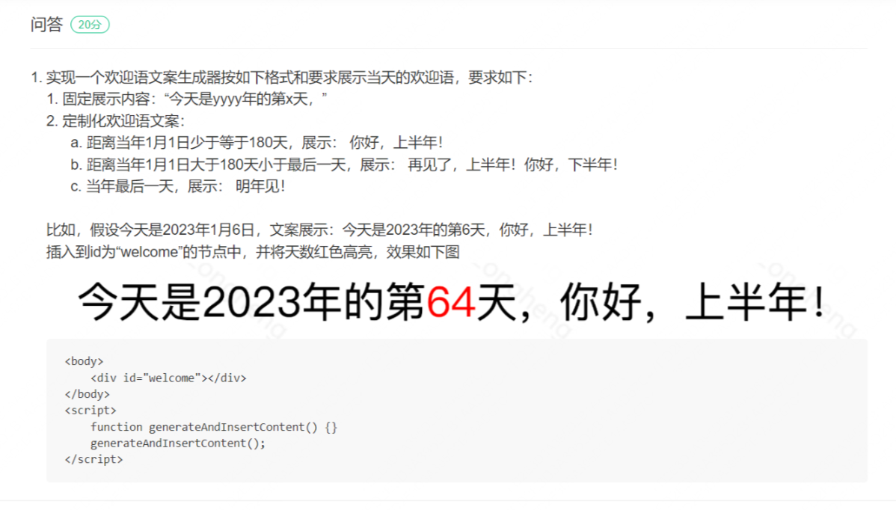
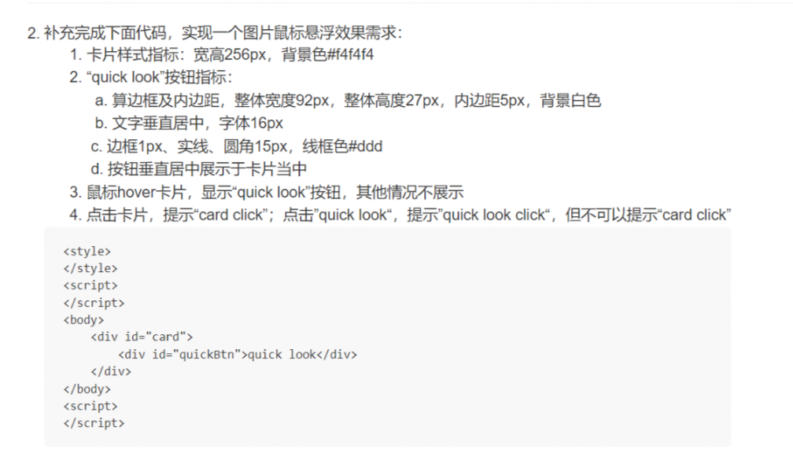
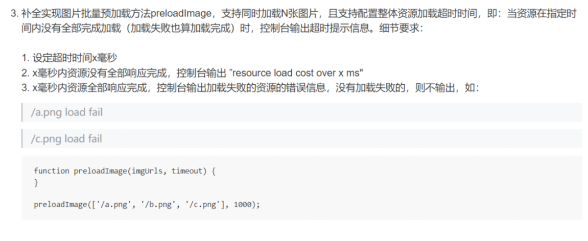

PDD笔试的形式是2道判断输入输出题，3道JS手撕代码题

------------------------------------------------

第一题题目:

------------------------------------------------

第二题题目:

-------------------------------------------------

第三题题目:

